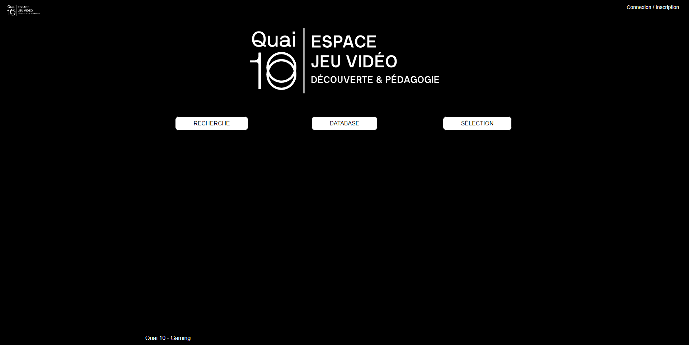

# projet-gaming-final
# Projet client pour l'espace gaming du quai 10 aka "Projet gaming"

## Description

Le but de ce projet est de créer une interface web permettant à l'Espace gaming de gérer sa database de jeux vidéos.

Notre source d'inspiration principale est [Playnite](https://playnite.link/).

Concernant l'espace gaming :  

>L’Espace jeu vidéo du Quai10 est un lieu culturel et pédagogique unique en Belgique. 
Il vous propose de découvrir une sélection bimestrielle de différents jeux exposés pour leur propos, leur originalité, leur force évocatrice, leur accessibilité et leur convivialité.

[Le site officiel du quai 10](https://www.quai10.be/gaming/lespacedexposition "Site Officiel du Quai 10")

L'Espace gaming n'est donc pas une salle d'arcade classique mais un lieu à vocation pédagogique proposant une sélection de jeux-vidéos tournant autour d'un même thème. (ex: L'IA , l'écologie, ... ). Ce thème, ainsi que la sélection de jeux associés, change régulièrement. 


L'interface doit remplir grosso-modo trois fonctions principales :

1. **L'import des données** : Pouvoir rechercher un jeux sur le net et importer et éditer ses données (nom, genres, plateforme,...) sur la database.
   
2. **La gestion des jeux** : Pouvoir afficher la liste des jeux avec la possibilité pour l'utilisateur de voter pour les jeux qu'il/elle préfère et de les ajouter à une sélection.
   
3. **La gestion des sélections** : Afficher une sélection avec les jeux qu'elle contient, rajouter des commentaires et générer un fichier Excel contenant les données des jeux sélectionnés à envoyer au département communication.

Les technologies utilisées sont :
- **React** pour le front
- **NodeJs** pour le back
- **SQL** pour la database

## Screenshots

### Onglet d'accueil



### Formulaire d'inscription


### Onglet Recherche
>Cet onglet permet de rechercher les jeux sur IGDB, éditer leurs données et les ajouter à la database locale.


### Onglet Database
>Cet onglet permet d'afficher les jeux présents sur le database SQL et de voter. 
>(WIP : Il devra aussi permettre de les ajouter à une sélection. )


### Onglet Sélection (Work In Progress)
>Cet onglet permettra d'afficher les jeux faisant partie d'une sélection, de modifier cette sélection, d'ajouter des commentaires et de générer un fichier Excel contenant toutes les infos des jeux sélectionnés à envoyer au département communication.


### A finir

<ul>
  <li> Le système de vote est non fonctionnel. Il est possible de voter à l'infini.
  <li> la génération de fichier excell depuis l'onglet sélection est manquante
</ul>


## Membres de la première équipe par ordre alphabétique

* **Cindy Buchet** : Front-end pour l'onglet Accueil et Recherche, modifs ultérieures des onglets Database et Sélection.
* **Corentin Deblock** : Project Manager - Back-end des onglet Database et Sélection. Création et gestion de la database sql et des routes. Back-end du fomulaire d'inscription. Rédaction du Readme.
* **Vincent De Gheyndt** : Project Manager - Back-end de l'onglet Recherche, requête Axios à l'API d'IGDB, traduction française des donnés et rédaction du Readme.
* **Lorenzo Menozzi** : Front-end des onglets Database et Sélection.
* **Jean-David Wuilquot** : Front-end du formulaire d'inscription.


## Résumé des commandes à connaitre:

  <ul>
    <li> <b>cd backend</b> && <b>npm start</b> : Lancer le backend
    <li> <b>cd react</b> && <b>npm start</b> : Lancer le frontend
    <li> Au niveau backend: 
    <ul>
      <li> <b>npm run create</b> : Crée la base de données
      <li> <b>node migrate.js</b> : Quand vous avez créé vos models (cf la doc de sequelize), permet de créer une migration pour que sequelize l'ajoute a votre base de données.
      <li> <b>npm run clean</b> : Permet de supprimer le cache et les migrations.
      <li> <b>npm run migrate</b> : Permet d'insérer les tables dans la base de données.
      <li> <b>npm run recreate</b> : Permet de recréer la base de données.
      <li> <b>npm run reborn </b>: Permet de recréer la base de données, supprimer les migrations et vider le cache.
      <li> <b>npm run rebornMigrate</b> : Permet de recréer la base de données, supprimer les migrations, vider le cache et envoyer toutes les migrations a la base de données
    </ul>
</ul>

### Exemple d'un fichier migration

```
module.exports = (sequelize, DataTypes) => {
  const User = sequelize.define('User', {
    picture:{
      type:DataTypes.STRING,
      allowNull:false
    },
    username:{
      type:DataTypes.STRING,
      allowNull:false,
      unique:true
    },
    password:{
      type:DataTypes.STRING,
      allowNull:false
    },
    email:{
      type:DataTypes.STRING,
      allowNull:false
    },
    rank: DataTypes.INTEGER,
  }, {});
  User.associate = function(models) {
    // associations can be defined here
    // Attibue un champ Games a User et lui dit qu'il en a plusieurs, ne fonctionne que si on mets un champ
    // Include lors de l'appel des objet de User (objet = données dans la table avec leur champ comme table)
    User.hasMany(models.Games);
    User.hasMany(models.Selections);
  };
  return User;
};
```

<ul>
  <li>type: Le type de données(DataTypes)
  <li>allowNull: Permet d'allouer ou pas une variable null(boolean)
  <li>unique: Permet d'indiquer si il doit étre unique(boolean)
</ul>

La doc de sequelize: https://sequelize.org/master/manual/models-definition.html

# Structure du projet

## Partie front 

### Dossier src

#### App.js
Contient la navbar de la web app Gaming
#### App.test.js
Component de base de React. On y a pas touché.
#### App2.js
La page Recherche.
Importe les différents components et effectue la requête axios vers l'API d'IGDB.
Une fois la requête effectuée, les données sont tranférées dans un state afin de pouvoir être affichées.

>NB : la requête utilise une api key à mon nom (Vincent De Gheyndt). En cas de problème, il ne faut pas hésiter à en créer une nouvelle au nom du client ou du développeur en charge de continuer le projet.

>NB2 : L'api d'IGDB était en migration vers sa V3 à l'époque où nous avons commencé ce projet. C'est pour celà que l'url de la requête (définie dans la class request) passe par herokuapp. Lorque la migration sera finie, il est pssible qu'il faille modifier l'url de la requête. Cf [la doc d'IGDB](https://api-docs.igdb.com/#cors-for-js-ionic)
#### App3.js
La page d'acceuil. Appelle le component Accueil et footer.
#### App4.js
La page Database. Appelle les différent components et effectue une requête fetch vers la database MySql pour afficher les jeux stockés (callfunc). Effectue également une requête fetch pour envoyer les votes sur la database.(vote)
#### App5.js
La page de connexion. Appelle les différents components.
#### App6.js
La page Sélection. Appelle les différents components.

NB : Initialement, Sélection s'appellait Curation. Le nom a été changé car Sélection était plus clair. Cependant les deux mots sont utilisés dans le code. (d'où l'existence d'un component Curation)
#### index.js
Component de base de React
#### index.scss
Component de base de React

### Dossier api

Les infos d'IGDB étant en anglais, il a fallu les traduire. Tous les components suivants contiennent les maps (key => values) avec les values traduites en français. La gestion de ces maps par rapport aux résultats de la requête axios vers L'api d'IGDB sont bien entendu dans app2.js juste après la requête axios.

Ainsi, si la requête renvoie l'id "8" pour le genre du jeux, on affichera dans l'onglet recherche la value correspondant à la key "8" de la map genresFr du component genres.js. Cette value, en l'occurence est "Plateforme".

Si ce n'est pas clair, consulter la doc d'IGDB et se renseigner sur les bases de données relationnelles.

#### gamemode.js

Map des modes de jeux en français.

#### genre.js

Map des genres de jeux en français.

#### pegi.js

Map des PEGI/ESRB (classement des jeux par âge) en français.
Les 5 premières key/values correspondent au PEGI (classement européen)
les 8 dernières key/values correspondent au ESRB (classement américain)

#### platform.js

Map des Plateformes de jeux en français.

#### theme.js

Map des modes de jeux en français.

### Dossier Components

#### Sous-dossier accueil
Components de la page accueil

##### accueil.js

Component principal de la page d'accueil

#### Sous-dossier curation
Components de la page Sélection

##### curation.js

Component principal de la page de sélection

#### Sous-dossier database
Components de la page database

##### filter.js

Onglet filtre de la page database. En pratique seul, la recherche par nom est activée.

##### info.js

Onglet info à gauche de la page database. Affiche les infos du jeux sélectionné.

##### liste.js

Component gérant la liste de jeux recherchée sur la database, le système de vote, la suppression d'un jeux, le rajout d'une justification.

#### Sous-dossier footer
Components du footer

##### footer.js
Component principal du footer. Utilisé sur chaque page.

#### Sous-dossier header
Components du header

##### header.js
Component principal du header. Utilisé sur chaque page.
s
##### HeaderAccueil.js

Component du Header utilisé sur la page d'accueil.

##### Logged.js

component gérant la connexion du client à son profil (à droite du header)

#### Sous-dossier membre
Components de la page de connexion

##### login.js

Component gérant l'espace membre (connection à un profil, création d'un profil, déconnection,...)

#### Sous-dossier recherche
Components de la page recherche

##### AperçuJeux.js

Gère l'affichage des données du jeux sélectionné dans la liste de jeux (à gauche). Par défaut, la première entrée est affichée.

##### FiltreJeux.js

Colonne de droite. Filtres pour recherche des jeux. En pratique, seule la recherche par nom fonctionne. Les filtres sont désactivés.

##### ListeJeux.js

Colonne de gauche. Liste des résultats de la recherche par nom. Cliquer sur l'un des résultats affiche ses données sur le component central.

#### form.js
Requête fetch qui envoie les données de connexion (le profil) sur la database

#### ImageShop.js
Component qui stocke l'image des shops (steam, gog, ...) sur lequel le jeu est trouvable.

Est appelé dans les onglets recherche, database et sélection.
N'est donc pas stocké sur la database.

NB : Seul Steam est pris en charge à l'heure actuelle.

#### index.js

Exporte les components du dossier components.

#### Selection.js

Requête fetch vers la database pour afficher les sélections (non-utilisé)

## Partie back-end

Tout le back-end s'occupe des relations entre les tables de la database en MySql.

Il fait en sorte que toutes les données captées ou modifiées par le front-end soient automatiquement uploadées au sein de MySql sans qu'on ait à le faire manuellement.

Similaire à des frameworks tel que django (migrations, gestion de database,...) et Sequelize.

### dossier config

Contient les fichiers de configuration du back-end.

### dossier upload

Contient les images de profil à uploader pour les comptes utilisateurs.

### dossier models

Contient les modèles ("les templates") des tables de données pour My Sql

### dossier routes

Contient les fichiers gérants les routes. C'est-à-dire les différents URLs auxquelles l'application doit répondre.

### migrate

FIchier qui gère automatiquement la modification des tables de données selon les modèles prédéfinis. (aka "la migration")

## Quelques liens utiles pour la compréhension du back-end

[Qu'est-ce qu'une migration ?](https://www.alooma.com/blog/what-is-database-migration)

[Qu'est-ce que Sequelize](https://sequelize.org/)

[Les migrations dans Django](https://docs.djangoproject.com/fr/2.0/topics/migrations/)

